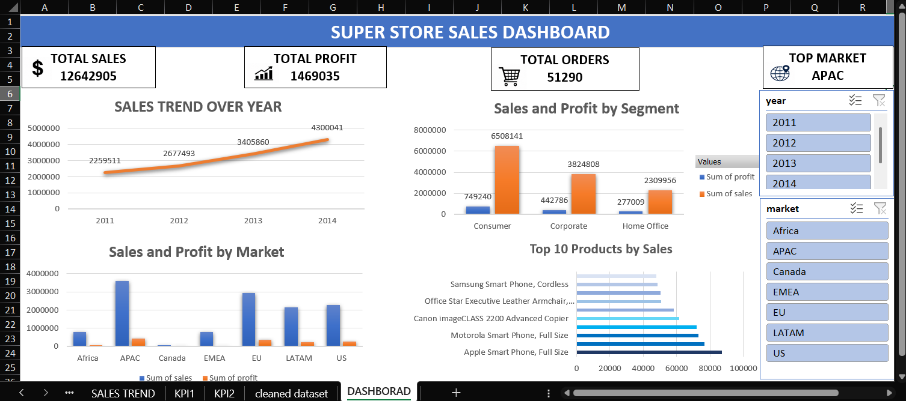

# Superstore Sales Dashboard — Excel

An interactive sales dashboard built using Microsoft Excel to analyze sales, profit, orders, market performance, customer segments, and top-selling products.

## 📊 Dashboard Preview

## 🎯 Project Objective

The objective of this project was to transform Superstore sales data into an interactive dashboard that provides a clear overview of business performance and helps identify important sales and profit trends.

## 🛠️ Tools & Skills

- Microsoft Excel
- Data Cleaning
- PivotTables
- PivotCharts
- Excel Slicers
- KPI Calculations
- Data Visualization
- Dashboard Design

## 📌 Key KPIs

- Total Sales
- Total Profit
- Total Orders
- Top Market

## 📈 Dashboard Visualizations

- Sales Trend Over Year
- Sales and Profit by Segment
- Sales and Profit by Market
- Top 10 Products by Sales
- Interactive Year Filter
- Interactive Market Filter

## 🔍 Key Insights

### 1. Overall Sales and Profit Performance

The Super Store generated approximately **$12.64 million in total sales** and **$1.47 million in total profit** across the period from **2011 to 2014**, with a total of **51,290 orders**.

The overall profit margin is approximately **11.6%**, meaning that for every $100 in sales, the business generated roughly $11.60 in profit. This indicates that the business was profitable overall while still having opportunities to improve profitability.

### 2. Strong and Consistent Sales Growth

Sales increased consistently throughout the four-year period.

Sales grew from approximately **$2.26 million in 2011** to **$2.68 million in 2012**, then increased further to approximately **$3.41 million in 2013** and reached around **$4.30 million in 2014**.

Overall, sales increased by approximately **90% between 2011 and 2014**. This shows a strong positive growth trend and indicates that the business significantly expanded its sales during the period analyzed.

### 3. 2014 Was the Strongest Sales Year

**2014 was the highest-performing year**, with approximately **$4.30 million in sales**.

Compared with 2011 sales of approximately $2.26 million, the 2014 result represents almost twice the sales generated at the beginning of the period.

The continuous increase in yearly sales suggests that the business was experiencing strong growth rather than relying on a single unusually successful year.

### 4. Consumer Segment Is the Largest Revenue Contributor

The **Consumer segment generated the highest sales**, with approximately **$6.51 million** in revenue.

Corporate generated approximately **$3.82 million**, while Home Office generated approximately **$2.31 million**.

Consumer therefore contributes more sales than Corporate and Home Office combined. This makes the Consumer segment the most important customer segment for overall revenue generation.

### 5. Consumer Segment Also Generates the Highest Profit

The Consumer segment generated approximately **$749,240 in profit**, which is the highest among the three segments.

Corporate generated approximately **$442,786**, while Home Office generated approximately **$277,009**.

This means that Consumer is not only the largest segment by sales but also the largest contributor to total profit. Maintaining strong performance in this segment is therefore particularly important to the business.

### 6. Profitability Is Relatively Consistent Across Segments

Although the Consumer segment generates the most total profit, the profit margins of the three segments are relatively similar.

Consumer has a profit margin of approximately **11.5%**, Corporate is also around **11.6%**, and Home Office is close to **12.0%**.

This suggests that the difference in total profit between the segments is primarily driven by their different sales volumes rather than a major difference in profitability.

### 7. APAC Is the Top Market

The dashboard identifies **APAC as the top market**, making it the strongest-performing market in the analysis.

APAC generates considerably higher sales than several of the other markets shown, indicating that it is an important contributor to the company's overall revenue.

The strong performance of APAC suggests that the region could be an important market for continued business expansion and investment.

### 8. Market Performance Varies Considerably

The market analysis shows noticeable differences in sales and profit contribution across **Africa, APAC, Canada, EMEA, EU, LATAM, and US**.

APAC has the highest sales, followed by **EU**, while markets such as Africa and Canada contribute considerably less.

This variation indicates that the business does not perform equally across all geographic markets. Understanding customer demand, product preferences, and profitability by region could help identify opportunities for improving weaker markets.

### 9. Sales and Profit Are Concentrated in the Stronger Markets

The markets with higher sales also contribute a larger share of overall profit. APAC and EU stand out as important contributors compared with smaller markets such as Africa and Canada.

This concentration means that the performance of the major markets has a significant impact on overall business results.

At the same time, lower-performing markets could be investigated further to determine whether they require different products, pricing strategies, or marketing approaches.

### 10. Technology Products Dominate the Top Products by Sales

The Top 10 Products by Sales visualization shows that **technology-related products are strongly represented among the highest-selling products**.

Products such as **Apple Smart Phone, Full Size**, **Motorola Smart Phone, Full Size**, and **Canon imageCLASS 2200 Advanced Copier** appear among the leading products.

This indicates strong customer demand for technology products and suggests that this category plays an important role in generating sales.

### 11. Apple Smart Phone, Full Size Is the Leading Product

Among the products displayed in the Top 10 Products by Sales chart, **Apple Smart Phone, Full Size** has the highest sales.

It is followed by other high-performing technology products, including **Motorola Smart Phone, Full Size** and **Canon imageCLASS 2200 Advanced Copier**.

The strong performance of these products suggests that technology products are an important area of revenue generation for the business.

### 12. Business Growth Is Supported by Multiple Factors

The dashboard shows that the business is not dependent on only one performance indicator.

Sales have increased significantly over time, the Consumer segment contributes the largest share of revenue and profit, APAC is the leading market, and technology products are among the strongest-selling products.

Together, these patterns indicate that the business experienced broad growth across **time, customer segments, geographic markets, and products**.

### 13. Areas for Further Business Analysis

Although the overall results are positive, the dashboard also highlights areas that could be investigated further.

The lower-performing markets could be analyzed to understand why their sales are significantly below APAC and EU. Similarly, the business could investigate why some products perform much better than others and whether high-sales products also generate high profit margins.

Analyzing **profit by individual product, market, customer, and year** could help identify where the business is generating the most profitable growth rather than focusing only on sales volume.

### 14. Overall Business Conclusion

Overall, the Super Store shows **strong sales growth between 2011 and 2014**, with sales increasing from approximately $2.26 million to $4.30 million.

The **Consumer segment is the main contributor to both sales and profit**, while **APAC is the top-performing market**. Technology products also appear prominently among the highest-selling products.

The business is therefore showing strong overall growth, but the differences between markets and products suggest opportunities to improve performance further by identifying the factors behind successful regions and products and applying those insights to weaker areas..

## 📁 Project Files

- **[Excel Dashboard](SuperStoreOrders.Project%202.xlsx)** — Interactive Excel dashboard and underlying data.
- **Dashboard Preview** — Screenshot of the completed dashboard.

## 👨‍💻 Author

**Jasil Fayad**

Aspiring Data Analyst | Excel | SQL | Power BI | Tableau | Python
